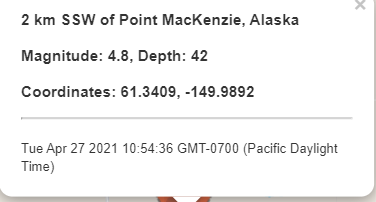
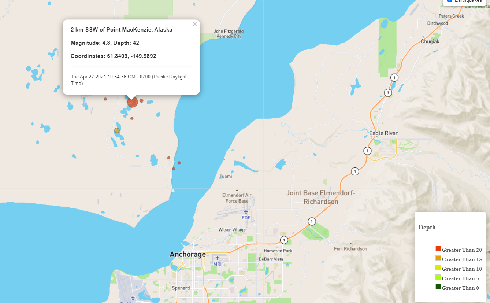

# Leaflet-Challenge Visualizing USGS Data with Leaflet

This website generates a a mutli layer Leaflet map in order to visualize seismic activity data that is provisioned from the USGS data feed [USGS Data Feed Site](https://earthquake.usgs.gov/earthquakes/feed/v1.0/geojson.php).  The site consists of a few different data feed options.  Our site utilizes the data feed that genereates a list of earthquakes that has occured over the past 7 days, which new data is synced every 10 minutes.

Utilizing javascript and D3 we consumed the GeoJSON formatted data from the USGS site.  Leaftlet has an object type L.GeoJSON that is designed to work with GeoJSON formatted data in order to streamline the plotting of the earthquake location points and using metrics (magnitude and depth) to correlate magnitude of earthquake to marker size and depth range category to a color.  The following is an example of the formatted data: 

The following is the snippet of code which shows the instantiation of the Leaflet GeoJson object, which features is an arrary of feature objects from extracted from API JSON response.

    var features = response.features;

    var earthquakes = L.geoJSON(features, {
        style: {
        weight: 2,
        opacity: .7,
        color: "#666",
        dashArray: '3',
        fillOpacity: 0.7         
        },
        onEachFeature: onEachFeature,
        pointToLayer: (featureData, latlng) => 
        {
         return L.circle(latlng,
            {radius: featureData.properties.mag*100,
            fillColor:getColor(featureData.geometry.coordinates[2]) }
            )
        }

 The **onEachFeature** property is set to an arrary of layers, which each layer is associated with each location feature in GeoJson file.  The following function returns an array of layers that consist of the pop up text for each location marker:

    function onEachFeature(featureData, layer) {
        layer.bindPopup("<h3>" + featureData.properties.place + "</h3>" +
                        "<h3>Magnitude: " + featureData.properties.mag + ", Depth: " +
                        featureData.geometry.coordinates[2] + "</h3>" +
                        "<h3>Coordinates: " + featureData.geometry.coordinates[1] + ", " + featureData.geometry.coordinates[0] + "</h3>" +
                        "

" + new Date(featureData.properties.time) + "
");
    }

The following is an example of the Popup text that is associated with each marker:

The array of circle markers associated with pointToLayer property, has a conditional color associted with each marker based on incident depth.
A function was created to associate the depth of the earthquake to a color range:

    function getColor(d) {
    return d > 20 ? '#e73d0a' :
            d > 15  ? '#e7a00a' :
            d > 10  ? '#dfe70a' :
            d > 5  ? '#acff0a' :
            d > 0   ? '#155803' :
                    '#FFEDA0';`
    };`

Along with CSS code and Javascript to create a legend on the Leaflet map:

CSS:

    .gtr20 { background-color: #e73d0a; }
    .gtr15 { background-color: #e7a00a; }
    .gtr10 { background-color: #dfe70a; }
    .gtr5 { background-color: #acff0a; }
    .gtr0 { background-color: #155803; }

Javascript:

    document.querySelector(".legend").innerHTML = [
    "<h3>Depth</h3>
" +
    "<ul class=\"no-bullets\">" +
        "<li>Greater Than 20</li>" +
        "<li>Greater Than 15</li>" +
        "<li>Greater Than 10</li>" +
        "<li>Greater Than  5</li>" +
        "<li>Greater Than  0</li>" +
    "</ul>"
    ].join("");

The following is a screenshot of the map visualization including legend:

## Final Product
[View Site](https://mregpala.github.io/leaflet-challenge/Leaflet-Step-1/)

